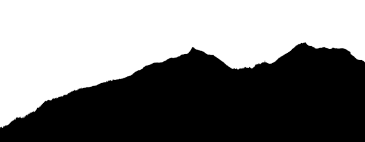

# makeprofile

Generate a png profile from an 8- or 16-bit digital elevation model


the above profile came from the horizontal centerline of this DEM


## Build
If you have gcc and libpng installed, this should be as easy as

    make

## Run
It helps to have a 16-bit DEM or DSM as the input, though an 8-bit file will do. No consideration is paid to matching the vertical and horizontal dimensions - you need to do that math and set the output image pixel sizes appropriately.

    ./makeprofile.bin -i FranceLesArcs.png -o profile.png -x 2000 -y 781

## To do
Many things need to be finished here!
* Use bilinear interpolation instead of nearest
* Allow arbitrary lines through the DEM/DSM
* Option to flip black and white in the output image

## Credits
Thanks to the developers of [CLI11](https://github.com/CLIUtils/CLI11). All the rest of the code is mine, cribbed from various projects.

## Citing makeprofile

I don't get paid for writing or maintaining this, so if you find this tool useful or mention it in your writing, please please cite it by using the following BibTeX entry.

```
@Misc{Makeprofile2023,
  author =       {Mark J.~Stock},
  title =        {Makeprofile:  Generate a png profile from a digital elevation model},
  howpublished = {\url{https://github.com/markstock/makeprofile}},
  year =         {2023}
}
```
